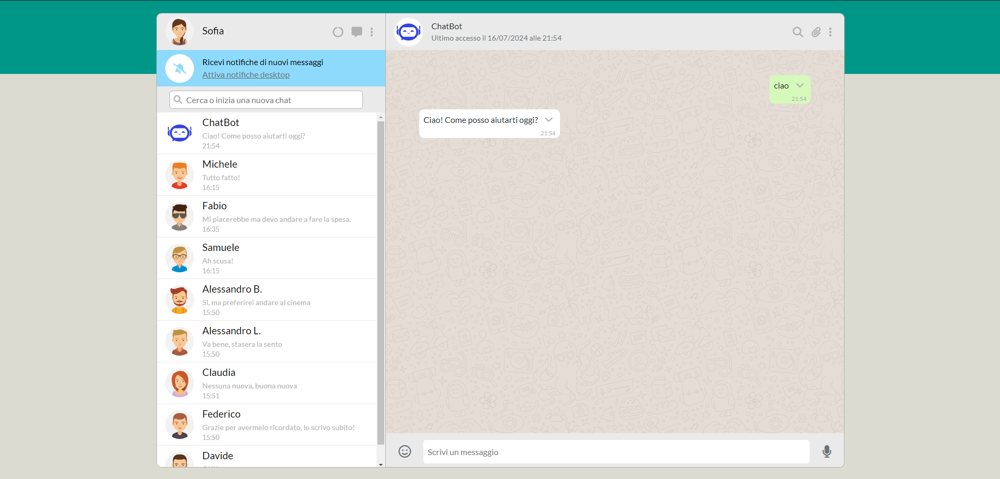

# Boolzapp - Clone di WhatsApp Web

## Descrizione del Progetto

Boolzapp è una web application che replica le funzionalità principali di WhatsApp Web. Questo progetto è stato sviluppato per dimostrare competenze avanzate in front-end development, con particolare focus sull'uso di Vue.js per la creazione di interfacce utente dinamiche e reattive.

## Funzionalità Principali

### Interfaccia Utente
- Design responsive che replica fedelmente l'aspetto di WhatsApp Web
- Lista contatti dinamica con avatar e informazioni dell'ultimo messaggio
- Area di chat con distinzione visiva tra messaggi inviati e ricevuti
- Input per la composizione e l'invio di nuovi messaggi

### Gestione Contatti e Conversazioni
- Visualizzazione dinamica dei contatti con nome e immagine del profilo
- Selezione dei contatti per visualizzare le conversazioni corrispondenti
- Aggiornamento in tempo reale della lista contatti e delle conversazioni

### Sistema di Messaggistica
- Invio di messaggi testuali tramite input dedicato
- Visualizzazione istantanea dei messaggi inviati nella chat
- Simulazione di risposta automatica dal contatto ("ok") dopo 1 secondo dall'invio

### Funzionalità di Ricerca
- Barra di ricerca per filtrare i contatti in tempo reale
- Visualizzazione dei risultati della ricerca aggiornati mentre l'utente digita

### Gestione Avanzata dei Messaggi
- Menu contestuale per la cancellazione dei messaggi
- Visualizzazione dell'orario di invio per ciascun messaggio
- Aggiornamento dell'anteprima dell'ultimo messaggio nella lista contatti

## Tecnologie Utilizzate

- **HTML5**: Struttura semantica della pagina
- **CSS3**: Styling avanzato e layout responsive
- **JavaScript (ES6+)**: Logica di programmazione e manipolazione del DOM
- **Vue.js**: Framework per la creazione di interfacce utente reattive
- **Axios** (opzionale): Gestione delle richieste HTTP per future integrazioni backend

## Visualizzare il progetto

Si può visionare il progetto a questo indirizzo https://marinodilauro.github.io/vue-boolzapp/
